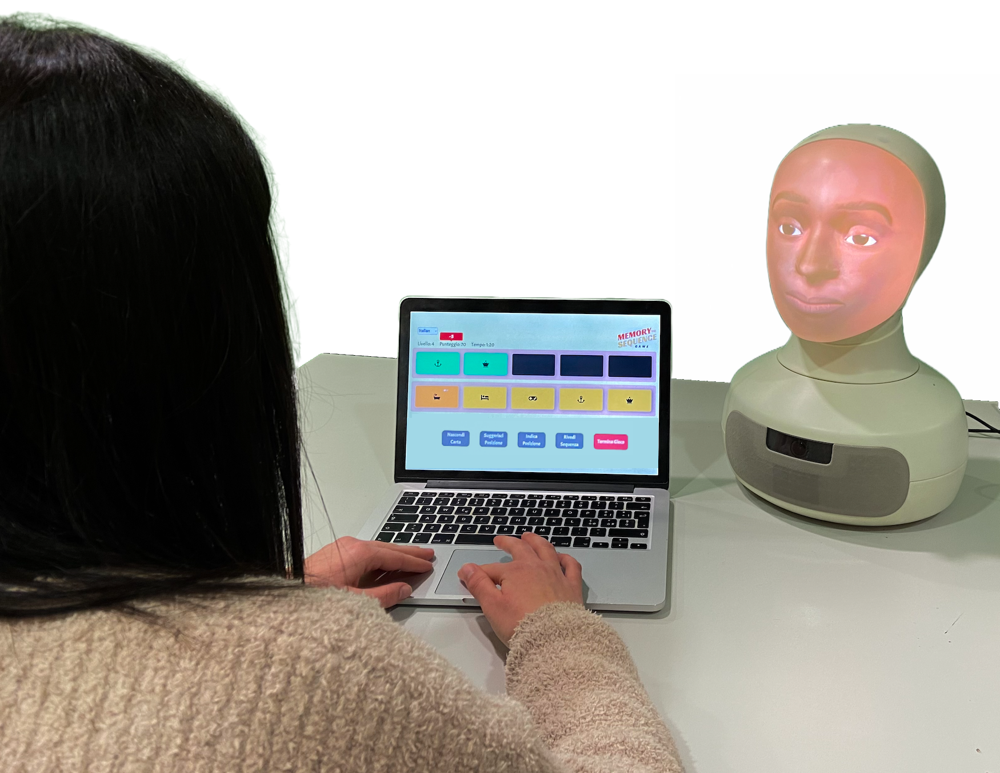
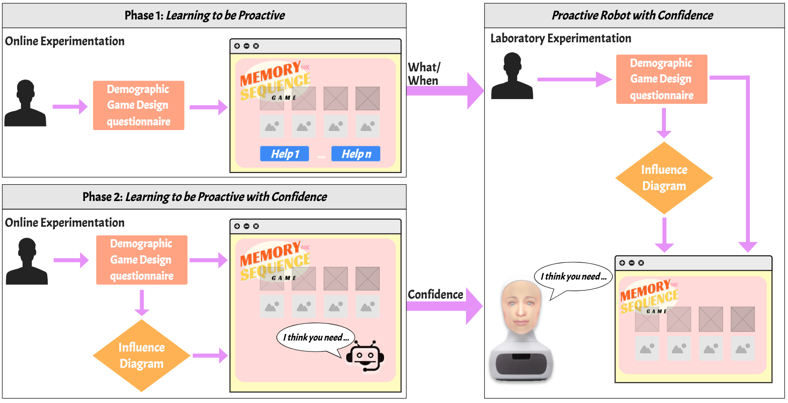
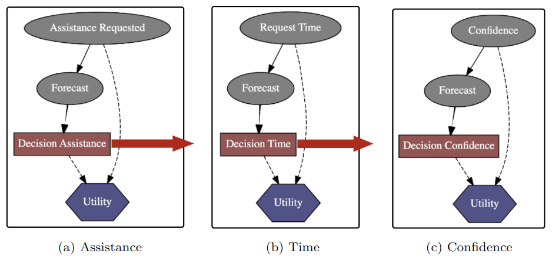
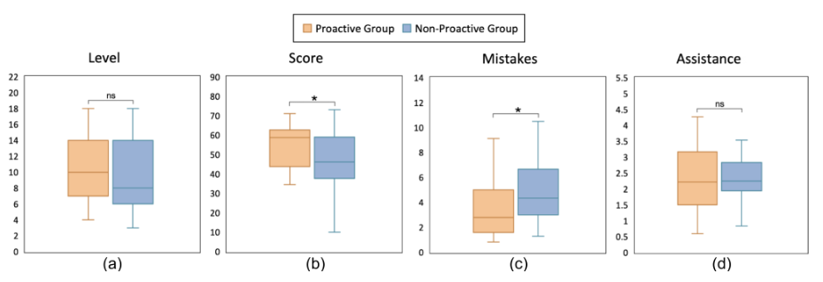
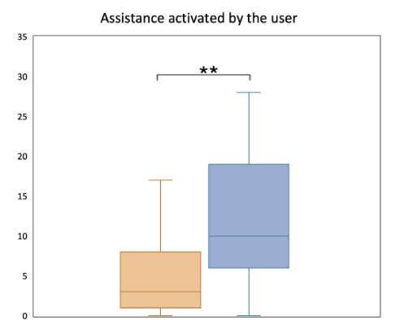

# A Bayesian Framework for Learning Proactive Robot Behaviour in Assistive Tasks

## Abstract
Socially assistive robots represent a promising tool in assistive contexts to improve people’s quality of life and well-being through social and emotional support, just like cognitive or physical. However, the effectiveness of interactions depends significantly on their ability to adapt to the needs of the assisted persons and act proactively in an anticipatory way, offering assistance before it is explicitly requested. Unfortunately, most of the previous work has only focused on what actions the robot should perform, rather than considering when to act and how confident it should be in a given situation. To address this gap, in this paper, we introduce a new data-driven framework that involves the use of a learning pipeline, consisting of 2 phases, with the ultimate goal of training an algorithm based on Influence Diagrams. The assistance scenario involves a sequential memory game where the robot learns autonomously what assistance to provide, when and with what confidence to take control and intervene. The results obtained from a user study showed that the proactive behaviour of the robot had a positive impact on the users’ game performance. They obtained higher scores, made fewer mistakes, and requested less assistance from the robot. The study also highlighted the robot’s ability to provide assistance tailored to users’ specific needs and to anticipate their requests.

## In brief

In this work, we intend to investigate how robots could be endowed with proactive behaviour to predict the users’ needs and support them in assistive tasks. We propose a definition of a computational approach that can be used for incrementally learning what assistance, when humans require it, and how confidently the robot should take control and intervene. Hence, the final goal is to learn an **Influence Diagram (ID)** that represents an extension of Bayesian networks, used to model decision-making problems based on uncertain information with the criterion of maximum expected utility. To this end, we devised a data-driven framework, which can be generalised to any type of assistive task and consists of a pipeline of different learning phases.

- Phase 1. [**Learning to be Proactive**](https://github.com/Prisca-Lab/proactive_robot_behaviour/tree/main/learning%20to%20be%20proactive), in which we request users to interact with a virtual-screen robot from which four levels of assistance can be requested at any time. Since we want to understand what variables influence user requests and whether these depend on a user model, we ask users to complete a  Demographic Game Design (DGD) questionnaire before the execution of the assistive task. Two IDs are learnt after this stage, one that decides what assistance users need and another one that decides when to offer it;
- Phase 2. [**Learning to be Proactive with Confidence**](https://github.com/Prisca-Lab/proactive_robot_behaviour/tree/main/learning%20to%20be%20proactive%20with%20confidence), in which we request users to interact with a proactive virtual-screen robot endowed with the IDs learnt in the previous stage. Here, we aim to learn the confidence level of the robot's actions. Specifically, in this stage, the robot provides assistance to the users with four increasing levels of confidence. Following this stage, an additional ID is trained enabling the robot to select, for each assistive action, the most suitable level of confidence; 

Finally, the resulting IDs (see the Figure below) are used to model the behaviour of a robot in an assistive task ([**Proactive Robot with Confidence**](https://github.com/Prisca-Lab/proactive_robot_behaviour/tree/main/proactive%20robot%20with%20confidence)). Here, participants played with the assistance of a Furhat robot.

## Main Findings

- The results showed that participants who interacted with the proactive robot achieved significantly higher scores and made fewer mistakes compared to those interacting with the non-proactive robot.
  
- Importantly, there was no significant difference in the amount of assistance provided between the two conditions, indicating that the proactive robot was more effective at delivering the right assistance at the right time.
  
- The study also found that participants who interacted with the proactive robot requested assistance less often, further supporting the system’s ability to anticipate their needs.
  
- However, there was no significant difference in how participants perceived the two robots in terms of social intelligence and proactivity. 

  

