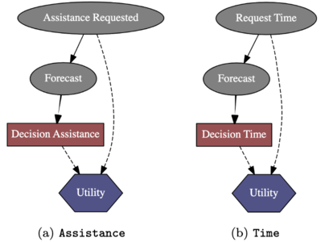

# Learning to be Proactive with Confidence
The project allows participants to play the "*Sequence Memory Game*" with the assistance of a proactive virtual-screen robot trained with the data collected in the previous phase. Before starting to play the game, the participant is shown a tutorial with game instructions on how to get points and request assistance with the option of playing a few trial levels. After the user has agreed to participate, one is asked to first fill out a demographic questionnaire on age, gender, and education level and then the Demographic Game Design questionnaire. Finally, the user starts playing with the possibility of asking for assistance, if one deems it necessary, or receiving assistance from the robot if it deems it necessary. The game ends if the user presses the end button or reaches the maximum level. For each user who finished the game, we collected the responses to the questionnaires and the game history, move by move, in a JSON file. 

## Computational Approach
The proposed computational method includes an Influence Diagram that allows decisions to be made about what assistance to give to the player at a given moment of the task. We decide to implement an influence diagram for each decision variable: **Assistance** (a), and **Time** (b). The proposed system will be trained on the data collected in the first phase (folder _data_ not available in this repository). In order for the IDs to be able to make the right decisions, they must also be aware of the errors that can make in the forecast. In detail, the a priori probability of the requests corresponds to the distribution of each class of the target in the train set, whilst the a priori probability of the predictions, conditional on the request, corresponds to the distribution obtained from the classification of the test set. Hence, based on the probability distribution returned by the estimators that will be set as the evidence of the forecasts, the IDs are able to make decisions after inference, net of the errors that the estimators may make during testing and maximising the expected utility. In this phase, the degree of confidence with which the virtual robot offers assistance is randomly generated and will only be included later. 
- For the IDs implementation see the _utils_.py file.

## Details
- The *_main_.py* file contains the main of the web application developed with Flask, a Python-based module that produces a web application using HTML, CSS and JavaScript. 
- The *templates* folder contains the HTML files, while the *static* folder contains the CSS, JavaScript or image files used. 
- The *json* folder contains the files used to set the language of the application (Italian/English).
- The *.json* files represent sample files of collected player data.

- The *svc_* files represent the SVM classifiers implemented for predicting _what_ assistance to provide and _when_.
- The *id_* files represent the influence diagrams implemented for deciding _what_ assistance to provide and _when_, with random _confidence_.

## To install: 
  - pip install flask (versione 2.2.2)
  - pip install scikit-learn (1.1.3)
  - pip install pyagrum (0.22.8)
  
## To execute:
  - python main.py   

