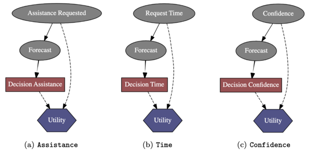

# Proactive Robot with Confidence
The project allows the game "*Sequence Memory Game*" to be played with the assistance of the real robot _Furhat_ under two different experimental conditions: 
1) **random decision system**, in which it is randomly chosen whether to provide assistance, which one, when and with what confidence 
2) **proactive decision system**, which is chosen by the system endowed with the model fine-tuned in the previous phases whether to provide assistance, which one, when and with what confidence.

Before starting to play, the participant is shown a tutorial with game instructions on how to get points and request assistance. After the user agrees to participate, one is asked to first fill out a demographic questionnaire on age, gender and education level and then the Demographic Game Design questionnaire. Finally, the user begins to play the game with the option of asking the robot for voice assistance if one deems it necessary, or receiving assistance if the Furhat robot deems it necessary. The game ends if the user presses the end button or reaches the maximum level. Next, the user is asked to fill out a post-interaction questionnaire: first the perceived social intelligence questionnaire, and then the robot service proactivity questionnaire. For each user who finished playing the game, we collected the responses to the questionnaires and the game history, move by move, in a JSON file. 

## Computational Approach
The proposed computational method includes an Influence Diagram trained with the data gathered from the first two phases that allow decisions to be made about _what_ assistance to give to the user, _when_ to provide it in a given moment of the task, and with what level of _confidence_. We decide to implement an influence diagram for each decision variable: **Assistance** (a), **Time** (b), and **Confidence** (c). In order for the IDs to be able to make the right decisions, they must also be aware of the errors that can make in the forecast. In detail, the a priori probability of the requests corresponds to the distribution of each class of the target in the train set, whilst the a priori probability of the predictions, conditional on the request, corresponds to the distribution obtained from the classification of the test set. Hence, based on the probability distribution returned by the estimators that will be set as the evidence of the forecasts, the IDs are able to make decisions after inference, net of the errors that the estimators may make during testing and maximising the expected utility. In this phase, the degree of confidence with which the virtual robot offers assistance is randomly generated and will only be included later. 
However, the **Assistance** and **Time** Decision Networks have already been implemented; here, the **Confidence** Decision Network will be trained on the data collected in the second phase (folder _data_ not available in this repository). 
- For the implementation see the _utils_.py file.

## Details
- The *_main\_.py* files contain the main of the web application developed with Flask, a Python-based module that produces a web application using HTML, CSS and JavaScript. 
- The *templates* folder contains the HTML files, while the *static* folder contains the CSS, JavaScript or image files used. 
- The *json* folder contains the files used to set the language of the application (Italian/English).
- The *.json* files represent sample files of collected player data.

1) The *data_random* folder contains the data obtained from the experiment with the **random decision system**.
2) The *data_proactive* folder contains the data obtained from the experiment with the **proactive decision system**.

- The *svc_* files represent the SVM classifiers implemented for predicting _what_ assistance to provide, _when_, and with what _confidence_.
- The *id_* files represent the influence diagrams implemented for deciding _what_ assistance to provide, _when_, and with what _confidence_.
 
## To install: 
  - pip install flask (versione 2.2.2)
  - pip install pyagrum (0.22.8)
  - pip install furhat_remote_api
  - pip install scikit-learn (1.1.3)
  
## To execute:
  - **random decision system**: python third_main_random.py 
  - **proactive decision system**: python third_main.py 
  
**Please note:** 
To execute the code, you must create an instance of the _FurhatRemoteAPI_ class by providing either the real address of the robot or the SDK running the virtual robot. To change the value check the statement of the *_main\_.py* files: 
- furhat = FurhatRemoteAPI(host="_localhost_") 
